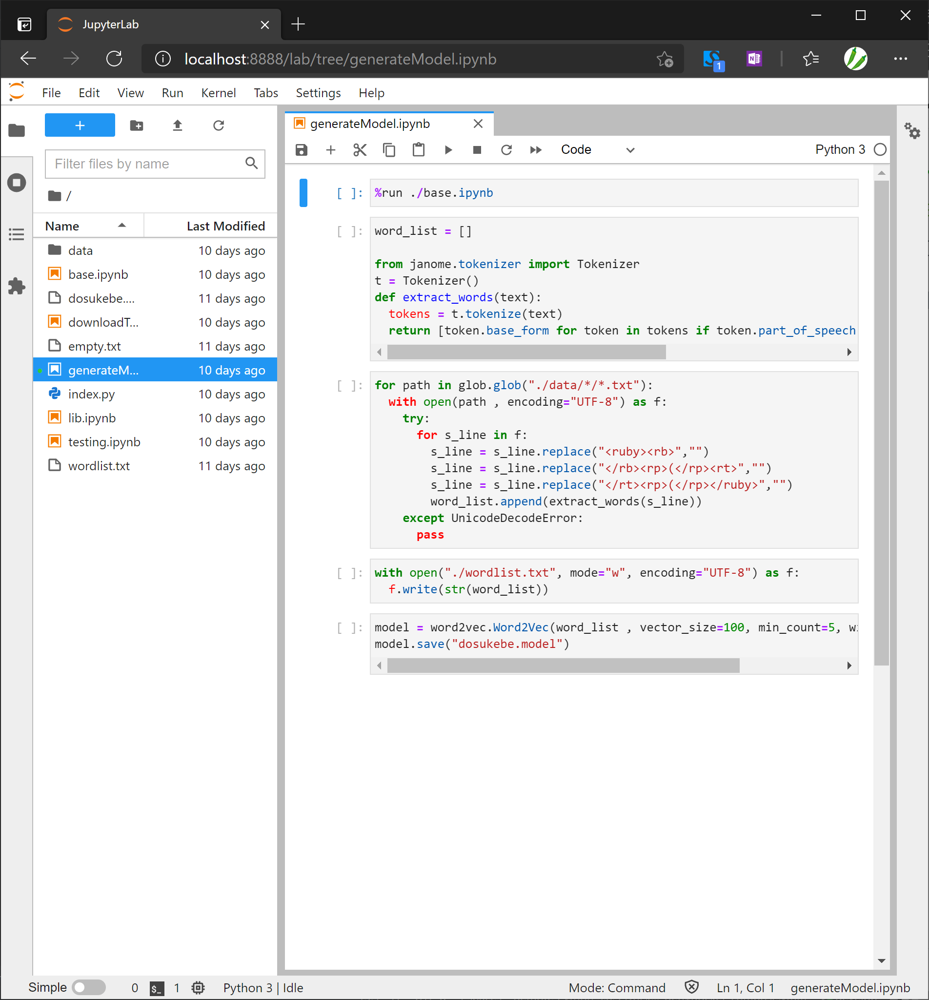
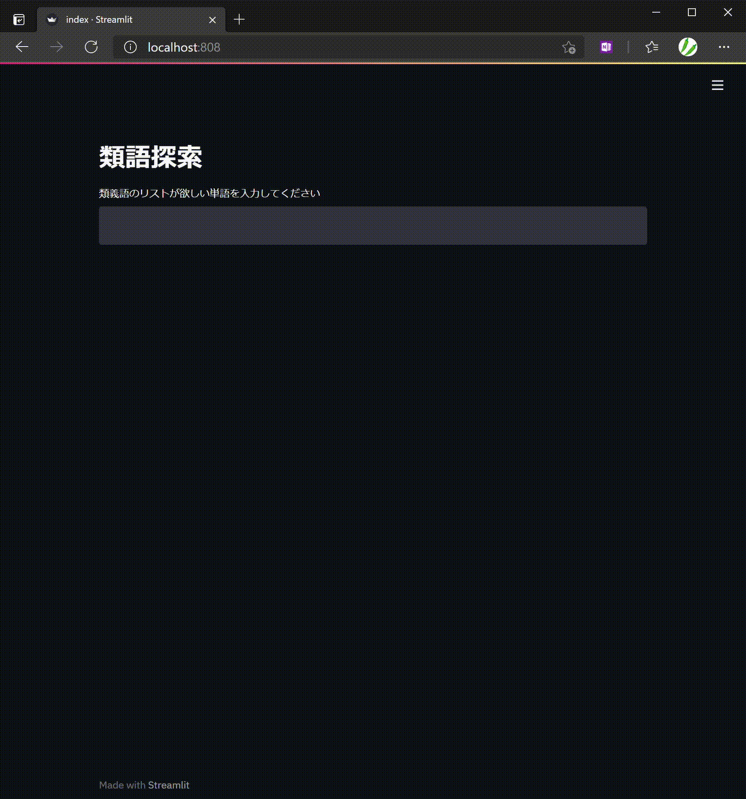

# DCM_gen

# 概要

# 構成

# 環境構築

## 起動

`/DCM_gen`で`docker-compose up`を実行

[localhost:8888](localhost:8888) にアクセス

下記画像のように `generateModel.ipynb` を開き、「▶▶」をクリックしてモデルを作成

モデルの作成が終わるまで待つ

## 実行

[localhost:808](localhpst:808)にアクセス

入力欄に類似度の高い単語のリストが欲しい単語を入力すると、リストが表示される。

